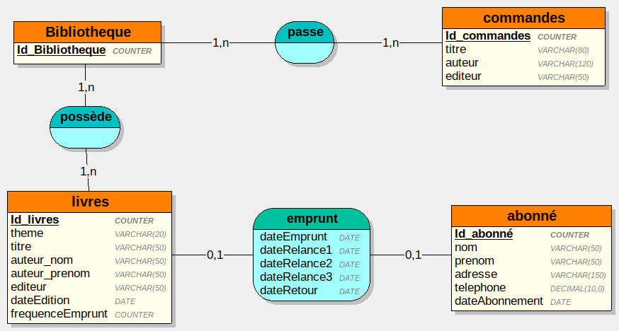

# Exercice 1 - Domaine de Gestion des emprunts



Script :
```sql  
DROP DATABASE IF EXISTS Bibliothèque;
CREATE DATABASE Bibliothque;
USE Bibliotheque;

CREATE TABLE livres(
   Id_livres COUNTER,
   theme VARCHAR(20),
   titre VARCHAR(50),
   auteur_nom VARCHAR(50),
   auteur_prenom VARCHAR(50),
   editeur VARCHAR(50),
   dateEdition DATE,
   frequenceEmprunt COUNTER,
   PRIMARY KEY(Id_livres)
);

CREATE TABLE commandes(
   Id_commandes COUNTER,
   titre VARCHAR(80),
   auteur VARCHAR(120),
   editeur VARCHAR(50),
   PRIMARY KEY(Id_commandes)
);

CREATE TABLE abonné(
   Id_abonné COUNTER,
   nom VARCHAR(50),
   prenom VARCHAR(50),
   adresse VARCHAR(150),
   telephone DECIMAL(10,0),
   dateAbonnement DATE,
   PRIMARY KEY(Id_abonné)
);

CREATE TABLE Bibliotheque(
   Id_Bibliotheque COUNTER,
   PRIMARY KEY(Id_Bibliotheque)
);

CREATE TABLE emprunt(
   Id_abonné INT,
   dateEmprunt DATE,
   dateRelance1 DATE,
   dateRelance2 DATE,
   dateRelance3 DATE,
   dateRetour DATE,
   Id_livres INT NOT NULL,
   PRIMARY KEY(Id_abonné),
   UNIQUE(Id_livres),
   FOREIGN KEY(Id_abonné) REFERENCES abonné(Id_abonné),
   FOREIGN KEY(Id_livres) REFERENCES livres(Id_livres)
);

CREATE TABLE possède(
   Id_livres INT,
   Id_Bibliotheque INT,
   PRIMARY KEY(Id_livres, Id_Bibliotheque),
   FOREIGN KEY(Id_livres) REFERENCES livres(Id_livres),
   FOREIGN KEY(Id_Bibliotheque) REFERENCES Bibliotheque(Id_Bibliotheque)
);

CREATE TABLE passe(
   Id_commandes INT,
   Id_Bibliotheque INT,
   PRIMARY KEY(Id_commandes, Id_Bibliotheque),
   FOREIGN KEY(Id_commandes) REFERENCES commandes(Id_commandes),
   FOREIGN KEY(Id_Bibliotheque) REFERENCES Bibliotheque(Id_Bibliotheque)
);
```