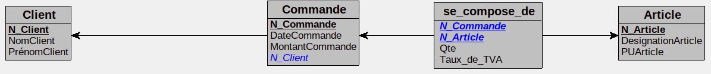

# Exercice 2


```sql
Modèle physique de données :

Client = (N_Client INT AUTO_INCREMENT, NomClient VARCHAR(50) , PrénomClient VARCHAR(50) );
Commande = (N_Commande INT AUTO_INCREMENT, DateCommande VARCHAR(50) , MontantCommande VARCHAR(50) , #N_Client);
Article = (N_Article INT AUTO_INCREMENT, DesignationArticle VARCHAR(50) , PUArticle VARCHAR(50) );
se_compose_de = (#N_Commande, #N_Article, Qte DECIMAL(3,0)  , Taux_de_TVA DECIMAL(2,1)  );

```



Script :
```SQL
DROP DATABASE magasin
CREATE DATABASE magasin
USE magasin

CREATE TABLE Client(
   N_Client INT AUTO_INCREMENT,
   NomClient VARCHAR(50) ,
   PrénomClient VARCHAR(50) ,
   PRIMARY KEY(N_Client)
);

CREATE TABLE Commande(
   N_Commande INT AUTO_INCREMENT,
   DateCommande VARCHAR(50) ,
   MontantCommande VARCHAR(50) ,
   N_Client INT NOT NULL,
   PRIMARY KEY(N_Commande),
   FOREIGN KEY(N_Client) REFERENCES Client(N_Client)
);

CREATE TABLE Article(
   N_Article INT AUTO_INCREMENT,
   DesignationArticle VARCHAR(50) ,
   PUArticle VARCHAR(50) ,
   PRIMARY KEY(N_Article)
);

CREATE TABLE se_compose_de(
   N_Commande INT,
   N_Article INT,
   Qte DECIMAL(3,0)  ,
   Taux_de_TVA DECIMAL(2,1)  ,
   PRIMARY KEY(N_Commande, N_Article),
   FOREIGN KEY(N_Commande) REFERENCES Commande(N_Commande),
   FOREIGN KEY(N_Article) REFERENCES Article(N_Article)
);
```
>Expliquer la tranformation du MCD en MPD  
>
>"N_Article" est la clé primaire de la table "Article". Cette table est liée à "se_compose_de" pour laquelle la clé primaire est composée de "N_commande" et de "N_Article. Par ailleurs "N_Commande" vient de la table "Commande" dont elle est la clé primaire. Cette dernière à pour clé étrangère la clé primaire de la table "Client", à savoir "N_Client".

___
>>> NOTA :  
MCD : Modeèle Concptuel de Donnée  
MPD : Modèle Physique de Donée